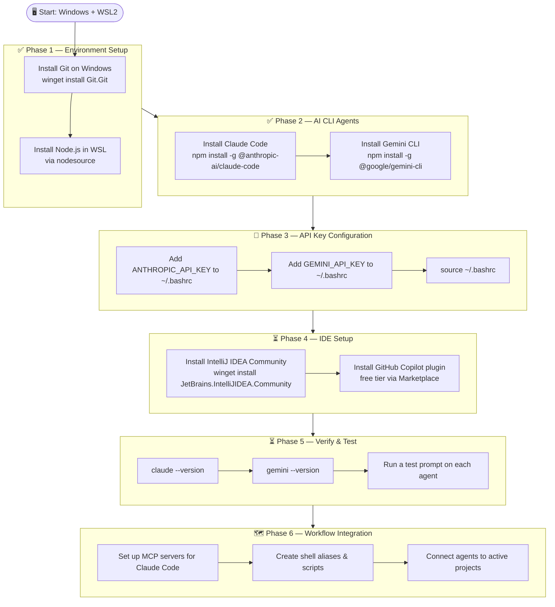

# Belliax_CLI_Test
Repo to install and configure local AI CLI agents via WSL.

---

## Project Phases

---

## Status

| Phase | Description | Status |
|-------|-------------|--------|
| 1 | Environment Setup (WSL, Node.js, Git) | ✅ Done |
| 2 | AI CLI Agents (Claude Code, Gemini CLI) | ✅ Done |
| 3 | API Key Configuration | 🔄 Next |
| 4 | IDE Setup (IntelliJ + GitHub Copilot) | ⏳ Pending |
| 5 | Verify & Test all agents | ⏳ Pending |
| 6 | Workflow Integration (MCP, aliases, projects) | 🗺️ Planned |

---

## Setup Guide

See [`Source/windows-ai-dev-setup.md`](Source/windows-ai-dev-setup.md) for full installation instructions.
